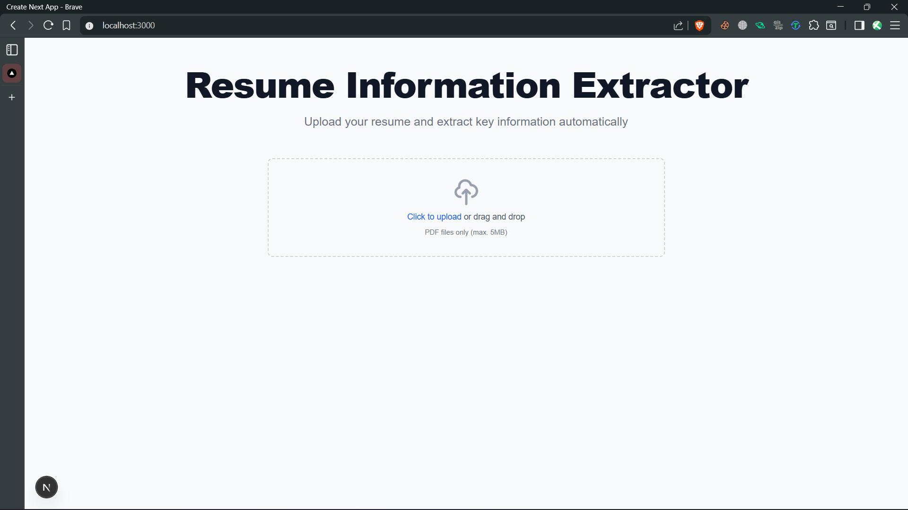

# Resume Information Extractor

A full-stack web application that extracts and highlights key information from resumes in PDF format. The application identifies and extracts details such as name, college/university, projects, achievements, and contact information.

## Features

- Upload PDF resumes
- Extract key information using text parsing and pattern matching
- Display the uploaded PDF with highlighted extracted information
- Clean, responsive UI built with Tailwind CSS
- Real-time processing and feedback

## Demo

Watch the application in action! The video below demonstrates the resume information extraction process:

[[Resume Information Extractor Demo]

](https://cap.so/s/51594gr2k4cfdn1)

*Click the image above to watch the demo video*


## Tech Stack

- **Frontend**: Next.js, React, TypeScript, Tailwind CSS
- **Backend**: Node.js (built into Next.js API routes)
- **APIs & Services**:
  - Affinda API: For advanced resume parsing and data extraction
- **Libraries**:
  - pdf-parse: For basic text extraction from PDFs
  - react-pdf: For PDF viewing and rendering
  - tesseract.js: For OCR (Optical Character Recognition) support

## Getting Started

### Prerequisites

- Node.js (v16 or later)
- npm or yarn

### Installation

1. Clone the repository:
   ```bash
   git clone https://github.com/RudrakshDev/Resume-Information-Extractor.git
   
   cd Resume-Information-Extractor
   ```

2. Install dependencies:
   ```bash
   npm install
   # or
   yarn install
   ```

3. Set up environment variables:
   - Create a `.env.local` file in the root directory
   - Add your Affinda API key:
     ```
     NEXT_PUBLIC_AFFINDA_API_KEY=your_affinda_api_key_here
     ```
   - Replace `your_affinda_api_key_here` with your actual API key from [Affinda](https://affinda.com/)

   **Tip:** See the [`.env.local.sample`](./.env.local.sample) file for reference.

4. Run the development servers:
   - After setting up environment variables, start the local development server:

     ```bash
     npm run dev
     ```

5. Open [http://localhost:3000](http://localhost:3000) in your browser to access the application.

## How It Works

1. **Upload**: Users can drag and drop or select a PDF resume file.
2. **Process**: The backend processes the PDF to extract text and identify key information.
3. **Display**: The frontend displays the PDF with highlighted sections and shows the extracted information in a clean, organized format.